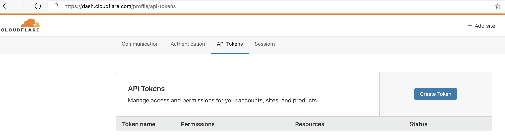

# Background

The user interface for the kitchen app.

## Infrastruture

This react app is published to cloudfare worker, it requires a subscription to the *workers kv* capability, for more details:

https://workers.cloudflare.com/

# Setting up capability to publish

In order create a web site in cloudfare, you need to connect and instruct cloudfare to do things.

## Steps 

1. To be able to connect you will need a password(called an api token). Here's how you create your api token:

Ensure you have `edit worker` capability, simplest way to achieve this is to use the `Edit Cloudflare Workers` template. 

2. To be able to instruct, you will need a command line interface(CLI) called wrangler

    npm i @cloudflare/wrangler -g

note: the `-g` makes wrangler accessible not just in your current project, but everywhere on your computer

3. Configure wrangler to use your api token by running 
    wrangler config

4. Create a file called `.loc-to-prod` in the same directory as this Readme.MD file, in it enter your cloudfare account id like this

    `CF_ACCOUNT_ID=<replace with your cloudfare account id>`

## Expected outcome 

You should be able publish your ui to a website (after you've built the application with `npm run build-prod`) using:
    
    npm run loc-to-prod